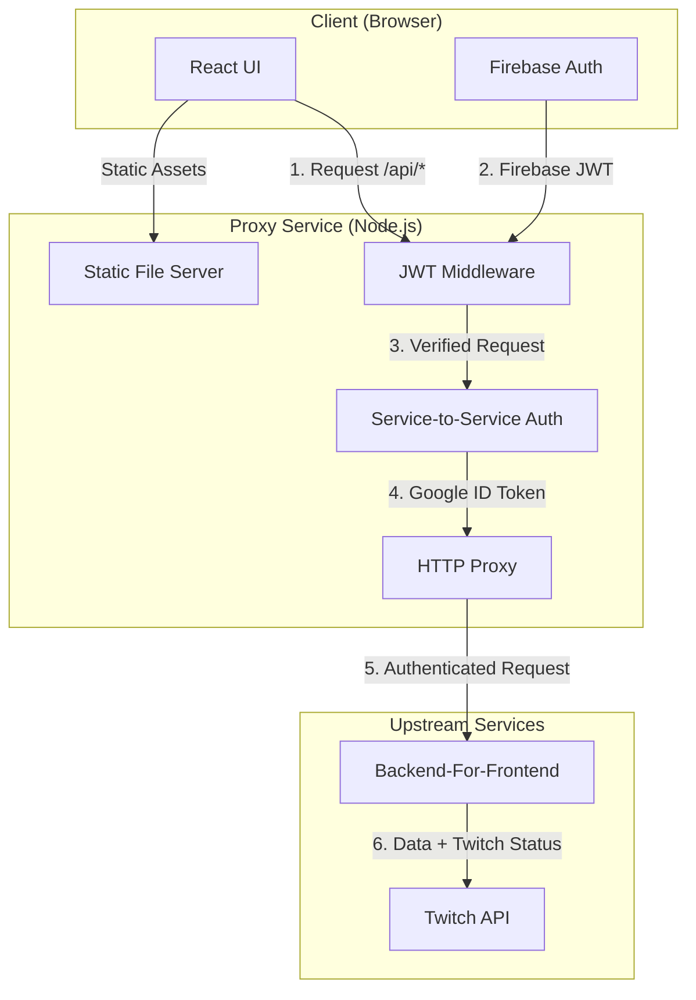
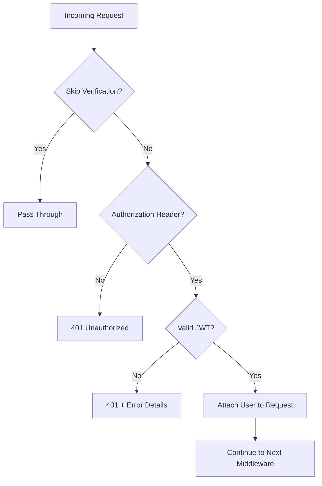
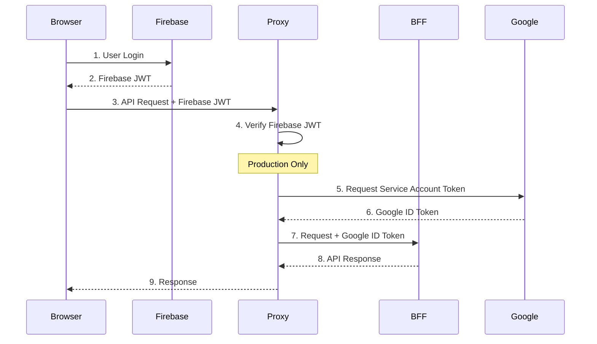

# Stream-Watcher Proxy Service - Technical Documentation

A sophisticated Node.js Express-based Backend-For-Frontend (BFF) proxy that provides secure authentication, service-to-service communication, and serves the React UI for the Stream-Watcher application.

## 🏗️ Architecture Overview

The proxy service sits between the React frontend and the upstream BFF service, handling authentication, request routing, and security concerns.



## 📁 Code Structure

```
packages/proxy/
├── src/
│   ├── app.ts              # Main Express application factory
│   ├── app.test.ts         # Integration tests for app.ts
│   ├── index.ts            # Server entry point
│   ├── config.ts           # Configuration management
│   ├── config.test.ts      # Configuration tests
│   ├── test-setup.ts       # Test environment setup (Vitest)
│   ├── auth/               # Authentication modules (NEW)
│   │   ├── firebase/       # Firebase JWT verification
│   │   │   ├── verifier.ts
│   │   │   ├── config.ts
│   │   │   ├── errors.ts
│   │   │   └── types.ts
│   │   ├── google/         # Google token generation
│   │   │   ├── tokenGenerator.ts
│   │   │   ├── config.ts
│   │   │   ├── errors.ts
│   │   │   └── types.ts
│   │   ├── middleware.ts   # Unified auth middleware
│   │   ├── types.ts        # Common auth types
│   │   └── index.ts        # Auth module exports
│   ├── middleware/
│   │   ├── auth.ts         # Legacy auth middleware (backward compatibility)
│   │   └── auth.test.ts    # Authentication middleware tests
│   ├── types/
│   │   └── express.d.ts    # Express type extensions (req.user)
│   └── test-helpers/
│       └── jwtHelpers.ts   # JWT utilities for testing
├── scripts/
│   └── makeToken.ts        # JWT token generation utility
├── example.env             # Local development template
├── example.env.docker      # Docker environment template  
├── example.env.production  # Production environment template
├── package.json           # Dependencies and scripts
├── tsconfig.json          # TypeScript configuration
└── vitest.config.ts       # Test configuration
```

## 🔧 Core Components

### 1. Application Factory (`app.ts`)

The heart of the proxy service that orchestrates all middleware and routing:

**Key Responsibilities:**
- Configures CORS and logging
- Sets up JWT verification for `/api/*` routes
- Implements service-to-service authentication (Google ID tokens)
- Proxies requests to upstream BFF
- Serves static React UI assets

**Critical Code Paths:**
```typescript
// 1. Load environment-specific auth configurations
const firebaseConfig = getFirebaseAuthConfig();
const googleConfig = getGoogleAuthConfig();

// 2. Create unified auth middleware
const authMiddleware = createAuthMiddleware(
    firebaseConfig,
    googleConfig,
    config.bffAudience
);

// 3. Apply auth middleware to API routes
app.use('/api', authMiddleware);

// 4. HTTP Proxy to BFF
app.use('/api', createProxyMiddleware(proxyOptions));
```

### 2. Configuration Management (`config.ts`)

Handles complex configuration scenarios across development, Docker, and production environments:

**Configuration Hierarchy:**
1. **Secrets** (production): `APP_CONFIG_JSON` from Google Secret Manager
2. **Environment Variables**: Direct env vars for flexibility
3. **Defaults**: Sensible local development defaults

**Key Features:**
- Validates critical configuration at startup
- Supports both PEM keys and JWKS URIs for JWT verification
- Environment-specific BFF targeting

### 3. Authentication Middleware (`middleware/auth.ts`)

Sophisticated JWT verification supporting multiple key sources:

**Verification Flow:**


**Key Security Features:**
- Supports both static PEM keys and remote JWKS
- Validates issuer and audience claims
- Graceful error handling with detailed logging
- Caching of verification keys for performance

## 🔐 Authentication Flow

### End-to-End Authentication



### Security Layers

1. **User Authentication**: Firebase JWT verification
2. **Service Authentication**: Google Cloud service account tokens
3. **CORS Protection**: Environment-specific origin handling
4. **Request Validation**: Comprehensive JWT claim validation

## 🌐 Environment Profiles

The proxy supports three distinct deployment profiles:

| Profile | Environment | Auth Mode | Primary Use Case |
|---------|-------------|-----------|------------------|
| **Local** | Developer machine | Disabled (`SKIP_JWT_VERIFY=true`) | Rapid development & UI testing |
| **Docker** | Containerized (dev/staging) | PEM Key | Integration testing & demos |
| **Production** | Cloud Run / K8s | JWKS or PEM | Live application |

### Profile-Specific Configurations

**Local Development:**
```bash
# Fast iteration, no auth complexity
SKIP_JWT_VERIFY=true
BFF_TARGET_URL=http://localhost:3001
```

**Docker:**
```bash
# Production-like with local secrets
JWT_PUBLIC_KEY=file:///secrets/jwt_pub.pem
BFF_TARGET_URL=http://bff:3001
```

**Production:**
```bash
# Cloud-native with managed secrets
JWT_JWKS_URI=https://www.googleapis.com/oauth2/v3/certs
BFF_TARGET_URL=https://bff-service.run.app
```

## 🚀 Request Processing Pipeline

### Static Asset Requests
```
GET /assets/app.js → Express Static → React Bundle
```

### API Requests
```
POST /api/channels → JWT Verify → S2S Auth → Proxy → BFF
```

**Detailed API Flow:**
1. **CORS Handling**: Validate origin and headers
2. **JWT Verification**: Decode and validate Firebase token
3. **Request Enhancement**: Add service account token (production only)
4. **Header Management**: Remove/modify headers for upstream compatibility
5. **Proxy Forward**: Route to BFF with authentication
6. **Response Handling**: Stream response back to client

## 🔧 Configuration Reference

### Critical Environment Variables

| Variable | Required | Purpose | Example |
|----------|----------|---------|---------|
| `NODE_ENV` | Production | Controls service-to-service auth | `production` |
| `BFF_TARGET_URL` | Yes | Upstream BFF endpoint | `https://api.example.com` |
| `BFF_AUDIENCE` | Production | Token audience for Google auth | `https://api.example.com` |
| `JWT_ISSUER` | Recommended | Expected token issuer | `https://securetoken.google.com/project-id` |
| `JWT_AUDIENCE` | Recommended | Expected token audience | `project-id` |
| `SKIP_JWT_VERIFY` | Dev only | Bypass authentication | `true` |

### Configuration Validation

The service performs startup validation:
- Ensures Firebase project ID is available when auth is enabled
- Validates that either PEM key or JWKS URI is configured
- Confirms BFF target URL is accessible

## 🧪 Testing Strategy

### Test Categories

1. **Unit Tests**: Individual middleware and utility functions
2. **Integration Tests**: Full request/response cycles
3. **Configuration Tests**: Environment variable handling
4. **Authentication Tests**: JWT verification scenarios

### Test Utilities

- **Token Generation**: `scripts/makeToken.ts` for creating test JWTs
- **Mock Services**: MSW for intercepting external requests
- **Supertest**: Full HTTP request testing

## 📊 Monitoring & Observability

### Built-in Logging

- **Morgan**: HTTP request logging
- **Custom Logs**: Authentication events and proxy operations
- **Debug Logging**: Controlled by `LOG_BFF_TOKEN` environment variable

### Key Metrics to Monitor

1. **Authentication Failures**: 401 responses, JWT verification errors
2. **Proxy Errors**: 5xx responses from BFF
3. **Performance**: Request latency, token generation time
4. **Security**: CORS violations, malformed tokens

## 🚀 Deployment Patterns

### Local Development
```bash
npm run dev  # Starts with hot reload
```

### Docker Deployment
```bash
docker build -t stream-watcher-proxy .
docker run -p 8080:8080 --env-file .env.docker stream-watcher-proxy
```

### Production (Cloud Run)
```bash
gcloud run deploy proxy \
  --image gcr.io/project/stream-watcher-proxy \
  --set-env-vars NODE_ENV=production \
  --set-secrets APP_CONFIG_JSON=app-config:latest
```

## 🔄 Code Improvement Opportunities

### 1. Architecture Enhancements

**Health Checks & Readiness Probes**
```typescript
// Add comprehensive health checking
app.get('/health', async (req, res) => {
  const checks = await Promise.allSettled([
    checkBFFConnectivity(),
    checkJWKSAvailability(),
    checkMemoryUsage()
  ]);
  // Return detailed health status
});
```

**Metrics Collection**
```typescript
// Add Prometheus metrics
import promClient from 'prom-client';

const httpRequestDuration = new promClient.Histogram({
  name: 'http_request_duration_seconds',
  help: 'Duration of HTTP requests in seconds',
  labelNames: ['method', 'route', 'status_code']
});
```

### 2. Security Hardening

**Rate Limiting**
```typescript
import rateLimit from 'express-rate-limit';

app.use('/api', rateLimit({
  windowMs: 15 * 60 * 1000, // 15 minutes
  max: 100, // limit each IP to 100 requests per windowMs
  message: 'Too many requests from this IP'
}));
```

**Request Validation**
```typescript
import { body, validationResult } from 'express-validator';

// Add request schema validation
app.post('/api/channels', 
  body('channelName').isString().isLength({ min: 1 }),
  validateRequest,
  // ... existing middleware
);
```

### 3. Performance Optimization

**Response Caching**
```typescript
import NodeCache from 'node-cache';

const responseCache = new NodeCache({ stdTTL: 300 }); // 5 minutes

// Cache BFF responses for non-user-specific data
app.use('/api/public', cacheMiddleware);
```

**Connection Pooling**
```typescript
// Implement HTTP agent with connection pooling
const proxyOptions = {
  // ...existing options
  agent: new http.Agent({
    keepAlive: true,
    maxSockets: 50
  })
};
```

### 4. Reliability Improvements

**Circuit Breaker Pattern**
```typescript
import CircuitBreaker from 'opossum';

const bffCircuitBreaker = new CircuitBreaker(callBFF, {
  timeout: 3000,
  errorThresholdPercentage: 50,
  resetTimeout: 30000
});
```

**Retry Logic**
```typescript
// Add intelligent retry for transient failures
const retryOptions = {
  retries: 3,
  retryCondition: (error) => {
    return error.response?.status >= 500;
  },
  retryDelay: axiosRetry.exponentialDelay
};
```

### 5. Development Experience

**Better Error Messages**
```typescript
// Enhance error context for debugging
class ProxyError extends Error {
  constructor(message: string, public statusCode: number, public context?: any) {
    super(message);
    this.name = 'ProxyError';
  }
}
```

**Configuration Validation**
```typescript
import Joi from 'joi';

// Add runtime configuration schema validation
const configSchema = Joi.object({
  bffTargetUrl: Joi.string().uri().required(),
  jwt: Joi.object({
    issuer: Joi.string().uri().when('skipVerification', { 
      is: false, 
      then: Joi.required() 
    })
  })
});
```

## 🎯 Migration Considerations

### Future Architecture Evolution

1. **Service Mesh Integration**: Consider Istio/Linkerd for advanced traffic management
2. **gRPC Support**: Add support for high-performance BFF communication
3. **Multi-tenant Support**: Enhance for multiple Firebase projects
4. **Edge Deployment**: Optimize for CDN edge locations

### Breaking Changes to Watch

- **http-proxy-middleware v4**: API changes in proxy configuration
- **Node.js 22+**: ESM module resolution changes
- **Express v5**: Router and middleware API updates

## 📚 Additional Resources

- [Firebase Authentication Docs](https://firebase.google.com/docs/auth)
- [Google Cloud Identity Documentation](https://cloud.google.com/docs/authentication)
- [http-proxy-middleware Configuration](https://github.com/chimurai/http-proxy-middleware)
- [Express.js Security Best Practices](https://expressjs.com/en/advanced/best-practice-security.html)

---

*This documentation reflects the current state of the proxy service. Update as the codebase evolves.* 

## ✅ Recent Improvements - Authentication Architecture Refactor

### 🏗️ **Completed: Separated Authentication Concerns**

**✅ NEW STRUCTURE:**
```
src/
├── auth/
│   ├── firebase/
│   │   ├── verifier.ts      # Firebase JWT verification
│   │   ├── config.ts        # Firebase-specific config
│   │   ├── errors.ts        # Firebase auth errors
│   │   └── types.ts         # Firebase JWT types
│   ├── google/
│   │   ├── tokenGenerator.ts # Google ID token generation
│   │   ├── config.ts        # Google-specific config
│   │   ├── errors.ts        # Google auth errors
│   │   └── types.ts         # Google token types
│   ├── middleware.ts        # Unified auth middleware
│   ├── types.ts            # Common auth types
│   └── index.ts            # Auth module exports
```

**✅ Benefits Achieved:**
- Clear separation between Firebase and Google authentication
- Environment-specific configuration (dev bypasses auth, prod requires full auth)
- Improved error handling with auth-specific error types
- Unified middleware that orchestrates both auth types
- All existing functionality preserved (zero breaking changes)
- All tests pass with new structure

## 🧹 TODO: Code Organization & Clean-up

### 🏗️ **High Priority - Architecture**

**1. ~~Separate Authentication Concerns~~ ✅ COMPLETED**

**2. Extract Service Layer**
```
src/
├── services/
│   ├── proxyService.ts     # HTTP proxy configuration & logic
│   ├── staticService.ts    # Static file serving logic
│   └── healthService.ts    # Health checks & monitoring
```

**3. Centralize Configuration Management**
```
src/
├── config/
│   ├── index.ts           # Main config export
│   ├── environments/
│   │   ├── local.ts       # Local dev overrides
│   │   ├── docker.ts      # Docker-specific config
│   │   └── production.ts  # Production config
│   ├── validation.ts      # Config schema validation
│   └── secrets.ts         # Secret manager integration
```

### 🔧 **Medium Priority - Code Quality**

**4. Add Error Handling Layer**
```
src/
├── errors/
│   ├── ProxyError.ts      # Custom error classes
│   ├── AuthError.ts       # Authentication-specific errors
│   ├── ConfigError.ts     # Configuration errors
│   └── middleware.ts      # Global error handling middleware
```

**5. Improve Testing Structure**
```
src/
├── __tests__/             # Move all tests here
│   ├── integration/       # Full request/response tests
│   ├── unit/             # Individual function tests
│   └── fixtures/         # Test data & mocks
├── test-helpers/
│   ├── jwt.ts            # JWT test utilities (renamed)
│   ├── supertest.ts      # HTTP test helpers
│   └── mocks.ts          # Mock implementations
```

**6. Add Validation Layer**
```
src/
├── validation/
│   ├── request.ts        # Request body/query validation
│   ├── jwt.ts           # JWT claim validation
│   └── config.ts        # Runtime config validation
```

### 🎯 **Low Priority - Developer Experience**

**7. Environment Management**
```
environments/             # Move from root to dedicated folder
├── local.env
├── docker.env
├── staging.env
└── production.env.template
```

**8. Documentation Structure**
```
docs/
├── architecture.md      # System design documentation
├── authentication.md   # Auth flow documentation
├── deployment.md       # Deployment guides
└── troubleshooting.md  # Common issues & solutions
```

**9. Scripts Organization**
```
scripts/
├── dev/
│   ├── makeToken.ts     # Move existing script here
│   ├── setupLocal.ts    # Local environment setup
│   └── testAuth.ts      # Auth testing utilities
├── build/
│   ├── compile.ts       # Custom build logic
│   └── validate.ts      # Pre-build validation
└── deploy/
    ├── docker.ts        # Docker deployment helpers
    └── cloudRun.ts      # Cloud Run deployment helpers
```

### 🔒 **Security Improvements**

**10. Security Middleware**
```
src/
├── security/
│   ├── rateLimit.ts     # Rate limiting implementation
│   ├── cors.ts          # CORS configuration
│   ├── helmet.ts        # Security headers
│   └── validation.ts    # Input sanitization
```

**11. Session Management**
```
src/
├── sessions/
│   ├── blacklist.ts     # Token blacklisting (Redis)
│   ├── store.ts         # Session storage interface
│   └── middleware.ts    # Session handling middleware
```

### 📊 **Monitoring & Observability**

**12. Observability Layer**
```
src/
├── monitoring/
│   ├── metrics.ts       # Prometheus metrics
│   ├── logging.ts       # Structured logging
│   ├── tracing.ts       # Request tracing
│   └── health.ts        # Health check endpoints
```

### 🔄 **Refactoring Tasks**

**13. Extract Constants**
```
src/
├── constants/
│   ├── http.ts          # HTTP status codes, headers
│   ├── auth.ts          # Auth-related constants
│   ├── config.ts        # Configuration keys
│   └── routes.ts        # Route patterns
```

**14. Improve Type Safety**
```
src/
├── types/
│   ├── express.d.ts     # Express extensions (existing)
│   ├── config.ts        # Configuration types
│   ├── auth.ts          # Authentication types
│   └── api.ts           # API request/response types
```

**15. Add Utility Functions**
```
src/
├── utils/
│   ├── jwt.ts           # JWT manipulation utilities
│   ├── http.ts          # HTTP helper functions
│   ├── environment.ts   # Environment detection
│   └── validation.ts    # Common validation functions
```

### 🧪 **Testing Improvements**

**16. Comprehensive Test Coverage**
- [ ] Add integration tests for full auth flow
- [ ] Add contract tests for BFF communication
- [ ] Add performance tests for proxy throughput
- [ ] Add security tests for auth bypass attempts

**17. Test Infrastructure**
- [ ] Set up test database/Redis for session tests
- [ ] Add test fixtures for different JWT scenarios
- [ ] Create mock BFF service for testing
- [ ] Add automated security scanning

### 📦 **Build & Deploy**

**18. Build Optimization**
- [ ] Add TypeScript path mapping for cleaner imports
- [ ] Set up ESLint rules for consistent code style
- [ ] Add pre-commit hooks for code quality
- [ ] Optimize Docker build layers

**19. Deployment Improvements**
- [ ] Add health check endpoints
- [ ] Add graceful shutdown handling
- [ ] Add configuration validation on startup
- [ ] Add deployment rollback procedures

### 🔍 **Code Analysis**

**20. Static Analysis**
- [ ] Set up SonarQube for code quality metrics
- [ ] Add dependency vulnerability scanning
- [ ] Add license compliance checking
- [ ] Add performance profiling

### 📈 **Performance**

**21. Performance Optimization**
- [ ] Add request/response caching layer
- [ ] Implement connection pooling for BFF calls
- [ ] Add request deduplication
- [ ] Optimize JWT verification caching

**22. Scalability Preparation**
- [ ] Add horizontal scaling support
- [ ] Implement circuit breaker pattern
- [ ] Add load balancer health checks
- [ ] Add auto-scaling metrics 